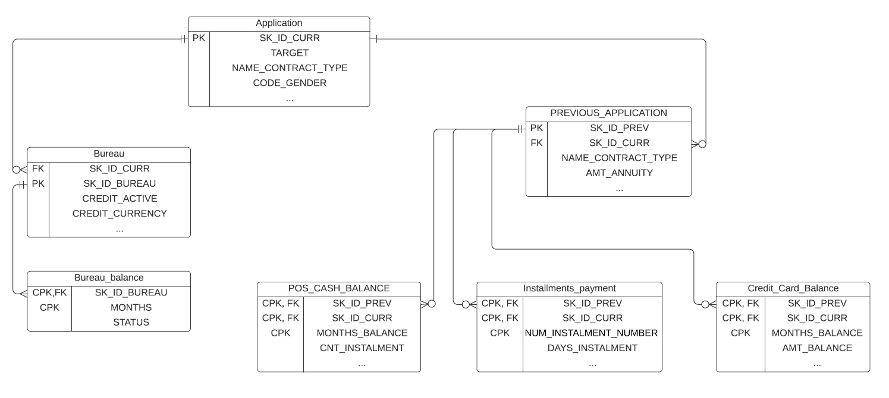

# Credit-Risk-Management
Building an end-to-end machine learning model to predict the probability of paying back a loan by an applicant.

# Problem Statement 
This is a supervised binary classification problem since the lables are provided in the application_train table (supervsied), and the lable is a binary variable with 0 (repaying the loan) and 1 (having difficulty repaying the loan).

# Setup
This code can be run with the following steps. This setup assumes you already have conda installed.
1. Create the conda environment: conda env create -f environment_hc.yml
2. Activate the environment: conda activate hc

# Data Source
I have collected the data from kaggle that was provided by [Home Credit financial institution]( https://www.kaggle.com/c/home-credit-default-risk/data).

There are two main tables related to the current credit application:

* __application_train__: This tables includes the information for the each loan application represented by an id of loan (__SK_ID_CURR__). The applicatoin_train table includes a TARGET column (1 : client with payment difficulties: he/she had late payment more than X days on at least one of the first Y installments of the loan, 0 : the loan was repaid) 
    
* __application_test__ : This table has the same column as the application_train, but does not have TARGET column. The TARGET column will be predicted by the           Machine     learning model and could be used in kaggle competition. Application_test is not used in this project.
    
There are two main sources of data related to the historical data of each application 1) Bureau 2) Home Credit which are presented in following tables:

1. __Bureau__:

    1. __Bureau__ : This table includes information for all client's previous credits provided by other financial institution that were reported to Credit Bureau.
    Each credit in bureau table is represented by a bureau id (__SK_ID_BUREAU__) which is related to the one id of loan application (__SK_ID_CURR__). One SK_ID_CURR can have 
    0,1,2 or more related previous credits (SK_ID_BUREAU) in bureau table showing a one-to-many relationship.
    2. __Bureau_balance__ : This table includes information related to the monthly balance of previous credits in Credit Bureau. This table has one row for each month of         history of every previous credit reported to Credit Bureau – i.e the table has (#loans in sample, #of relative previous credits, #of months where we have some history     observable for the previous credits) rows. 
    
2. __Home Credit__:

    1. __previous_application__: This table includes all previous application at Home Credit which represented by an id of loan (__SK_ID_PREV__). One SK_ID_CURR can have  
    0,1,2 or more related previous credits (SK_ID_PREV) in previous_application table showing a one-to-many relationship.
    
    2. __POS_CASH_BALANCE__: This table includes monthly balance of previous point of sale (POS) with Home Credit.
    
    3. __credit_card_balance__ : This table inlcudes monthly balance snapshots of previous credit cards that the applicant has with Home Credit
    
    4. __installments_payments__ : This table includes repayment history for the previously disbursed credits related to the loans in Home Credit database.

Description of all the columns will be found in HomeCredit_columns_description.csv which is available in the provided link.
The following Entity Relation Diagram (ERD) shows how different tables are related:

# Preprocessing of data
As shown in the above ERD each SK_ID_CURR is related to multiple SK_ID_BUREAU in Bureau table and to multiple SK_ID_PREV in Home Credit tables.
In order to develop machine learning model, first we need to flatten out the database. It means aggregate the information from 2 bureau and 4 Home Credit tables to have one merged table. Each row in the final merged table represents one loan application (SK_ID_CURR). 

Three different strategies have been used in this project to flatten out the database: 

1. __Manual feature engineering__: Manual Feature engineering involves leveraging domain knowledge to extract useful feature from data. With this strategy, we analyze each customer journey using bureau and Home Credit sources and extract useful information from previous loans cycle life. 

2. __Automated feature engineering__: Automated feature engineering use [Featuretools](https://community.alteryx.com/t5/Data-Science/Feature-Engineering-Secret-to-Data-Science-Success/ba-p/545041) library to generate hundreds or thousands of new features. We have used one level of depth since this is a computationally expensive work.

3. __Deep learning__: Deep learning strategy employs Convolution Nueral Network (CNN) and Recurrent Neural Network (RNN) to extract new feture from the data. The concept of using power of CNN for the feature engineering is discussed [here](https://towardsdatascience.com/convolutional-neural-network-on-a-structured-bank-customer-data-358e6b8aa759)  

# Imbalalanced Dataset
The dataset of this problem is significantly imbalanced with 91% of data not-defaulted and 9% being defaulted. The challenge of working with imbalanced dataset is that most machine learning algorithms perform poorly on the minortiy class that is more important to detect in the credit risk management. Three different strategy have been experimented to see their result on the model performance:

1. __Hierarchial clustering (undersampling) of majority class__: The idea is to undersample the majority class so that we end up having balanced data. We have ~27k positive training data (Mainority class) and ~300k negative data (Majority class). Undersampling needs to be done in a fashion that the resulted majority class has similar distribution to the original 300k, therefore, we do not lose information from data. Hieracrchial clustering (Agglomerative Clustering) has been conducted on majority class with 27k cluster. In the end, the resampled dataset had 1:1 data with 27k for positive and negative class.

2. __Hierarchial clustering (undersampling) of majority class & Oversampling of minority class__: Combination of clustering undersampling of majority class (method one) to 50% with oversampling of the minority class (up to 1:1 ratio) to get better performance. In this way, the majority class is reduced from 91% to 50% whereas minority class size is increased from 9% to 50%. Hierarchial clustering is used for undersampling and SMOTE is used for oversampling.

# Machine Learning Models:
We have tried boosted algorithms (XGBoost, LightGBM, Catboost) and fully connected neural network (FCNN) in this project. 
There are some technical differences in the application of different algorithms that needs to noticed:

* __Handling missing data__: XGBoost, LightGBM, and Catboost can handle missing data, but for FCNN the missing values needs to be imputed. The missing categorical variable is imputed by 'Not Available' new category and missing numerical feature is imputed by average of that column in the training data (to avoid data leakage).

* __Categorical variables__: XGBoost and FCNN can not handle categorical variable, therefore, one-hot encoding is performed on the categorical features. On the other hand, LightGBM and Catboost can handle categorical feature (use Fisher method), but the categorical features should be given to the algorithm to avoid error. This is accomplished by encoding each category to non negative integer and save it astype 'category' in [pandas](https://medium.com/swlh/dealing-with-categorical-variables-in-machine-learning-4401b949b093).

The hyperparameter of boosted algorithm is chosen using Bayasian hyperparameter optimization (Hyperopt ). 

# Performance Metric:

* __Precision, Recall, F1-Score__: In credit risk management the cost of misclassification of a 'defaulted applicant' as 'non defaulted' is very high and may cause significant loss of money for the financial institution. Therefore, we need to reduce the probability of approving a defaulted applicatn (False Negative (type 2 error)). Therefore, Recall is more important metric in this problem due to the high risk of losing money. Low precision might result in losing of a customer (False Positive), but not harm the business drastically. I also have presented F1-score that considers both precision and recall. However, when we are dealing with an imbalanced dataset such as in our case, we need to be careful a proper threshold for the classifier, different from the 0.5 (0.09 could be a good choice in this problem).      

* __Area Under ROC Curve (AUC)__: If we use original imbalanced dataset, ROC Curve is the appropriate metric to visualize the performance of binary classifier and Area under ROC (AUC) is the best way to summarize the classifier performance in just one number. In this way, the True positive rate and False positive rate for different threshold is presented and area under this curve is the AUC.

* __Cohen's kappa__: is a more conservative metric that is used in industry as a performance metric of a classifier. Cohen’s kappa  is a measure of the agreement between two raters and is between 0 to 1 . Cohen’s kappa of 1 indicates perfect agreement between the raters and 0 indicates that any agreement is totally due to chance.

